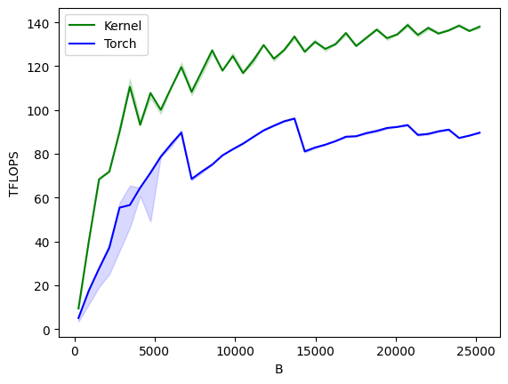

# Modulated Residual Network Kernel

Part of the modulated resnet is to compute the following:

```python
def modresnet_fwd(mod_act: torch.Tensor, syn_act: torch.Tensor, mod_weight: torch.Tensor, syn_weight: torch.Tensor):
  mod_act = torch.matmul(mod_act, mod_weight.transpose(-1, -2))
  mod_act = torch.nn.SiLU()(mod_act)
  syn_act = torch.matmul(syn_act, syn_weight.transpose(-1, -2))
  syn_act = torch.nn.SiLU()(syn_act)
  syn_act = syn_act*mod_act
  return mod_act, syn_act
```

This iterates over the layers of each pair of modulating resnet blocks, and then over the pairs of blocks as well.
There is more to the actual network, e.g. the skip connections, layer norms and projections, but this is a part of
it that is performed many times.

A kernel for this function performs pretty well (bfloat16 data type on an A100 40GB device):



Where the x-axis is the batch size, and the hidden dimension is fixed at 512. It's ~30% better.