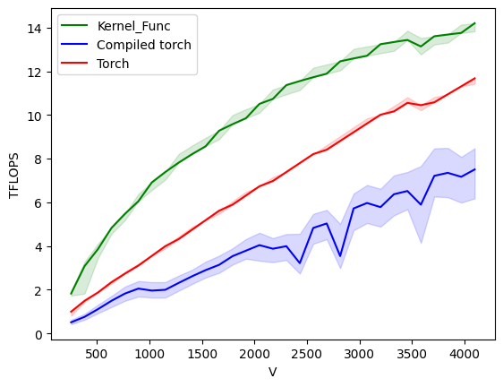
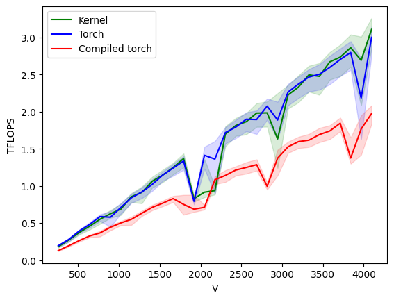
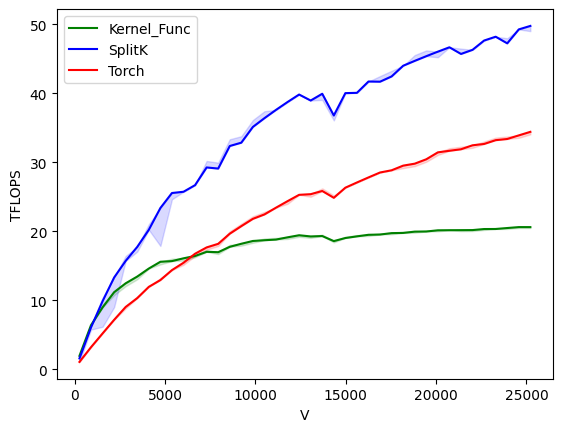

# Spatial Diffusion Kernel

Spatial Diffusion is the first layer of the Diffusion Net model architecture, described in
https://arxiv.org/abs/2012.00888.

The operations performed in Spatial Diffusion are as followed:
```python
def torch_diffusion(x, basis, mass, evalues, times):
    '''
    x: (NUM_VERTS, 256)
    basis: (NUM_VERTS, 128)
    mass: (NUM_VERTS)
    evalues: (128)
    times: (256)
    '''

    b_t = basis.transpose(-2, -1)
    x_m = x*mass.unsqueeze(-1)
    in_basis = torch.matmul(b_t, x_m)
    diffs = torch.exp(-evalues.unsqueeze(-1)*times)
    spectral = diffs*in_basis
    return torch.matmul(basis, spectral), spectral
```

## What makes sense to try to fuse into a kernel?

Matrix transposition is a cheap operation, there's no copy involved and it's really just an operation
on the metadata, it doesn't make sense to fuse that into the kernel as there isn't much to gain.

The main benefit would be to fuse the first matrix multiply with calculating the `diffs` matrix.
As that way we could compute the `spectral` matrix directly from `x` and `b_t` without needing to write
`x_m`, `in_basis` and `diffs` to HBM. This has the added benefit that the kernel would require less GPU vram,
as fewer intermediate tensors are stored for the backward pass.

## Results

Benchmarks were run using an A100 (40GB) GPU from Google Colab, `bfloat16` as the datatype,
and the benchmarking code in `bench_fwd.py`, `bench_bwd.py`.

### Forward Pass

Using just the forward pass of the custom `torch.autograd.Function` in `function.py`, the following plot is generated:



The x-axis `V` is the number of vertices.

Interestingly, `torch.compile` isn't very perfomant with these data sizes.

### Backward Pass

The backward pass is a bit trickier, as it needs to recompute some intermediate tensors to compute
the correct gradients for the input and the diffusion time parameters. Because of that, and because of
the difference in data sizes, two Triton kernels are needed to make these computations efficient.

What they are computing is essentially
```python
  def backward(ctx, dO, dS, s, b, m, e, d):
    '''
    Performs the backward pass for the input X and
    diffusion times D
    '''
    s_grad = dS + torch.matmul(b.transpose(-2, -1), dO)
    dD, dX = None, None
    dD = -(e.unsqueeze(-1) * s_grad * s).sum(dim=0)
    t = torch.exp(-e.unsqueeze(-1)*d)
    dst = s_grad*t
    dX = torch.matmul(b*m.unsqueeze(-1), dst)
    return None, dX, None, None, dD
```

The following plot gets generated from the benchmark:



It is a lot noiser that the forward pass, and a lot slower. This is due to autograd/backward calls
setting up a graph and propagating gradients backwards (the kernel's themselves are _much_ faster).

The kernel's are on par with the native pytorch implementation, which is impressive as they need to do
more computation. Again, the compiled torch function is well below on these data sizes.

## Is this worth it?

Probabaly not.

The gain in performance is minimal, as the function itself is still quick at these data sizes where `M` and `N` are fixed
at 128 and 256 respectively.
The decrease in vram also is not a huge amount in the grand scheme of things (it is in relative terms), unless the input
data has tens or hundreds of thousands of verts.

It has still been very interesting to see where gains can still be made, and very interesting to see where torch.compile is
lacking.

## Extra thoughts

When using bfloat16, A100s have 312 TFLOP/s for matmuls, and 39 TFLOP/s for non mamtul operations.
I'm pretty sure the kernel is still memory bound, rather than compute bound as increasing `M` and `N`
allows for much larger TFLOP/s. Eg when the matrices/vectors all have dimensions of 4096, the TFLOP/s will be ~220.
(Though, for that data size, the block sizes need to be different and even the kernel itself is different to get the best
performance out of it.)

`torch.compile` also gets significantly better at this computation once `M` and `N` are larger, though it doesn't
blow the rest out of the water.

# Can we do better?

Yes - as `V` scales larger, the first matrix multiply becomes the bottleneck. Computing a matmul like
`(N, V)@(V, W)` in the naive blocked way doesn't work well when `V` is really large. Instead, we can use
a split-k based algorithm since no part of the fused kernel requires the entire output block to be materialised
before operating on it (e.g via a relu say).

This works really well for the forward pass:



The above benchmark was for `float16` (since split-k uses atomic adds, which are only supported for float32 and float16),
though it looks very similar to `bfloat16` once some minor changes are made. This is much better than before, and is noticeable
faster than torch.