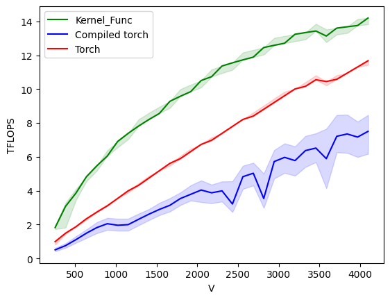
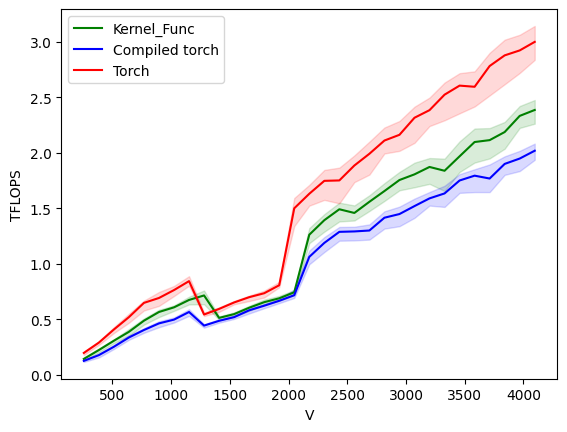

# Spatial Diffusion Kernel

The operations performed in Spatial Diffusion are as followed:
```python
def torch_diffusion(x, basis, mass, evalues, times):
    '''
    x: (NUM_VERTS, 256)
    basis: (NUM_VERTS, 128)
    mass: (NUM_VERTS)
    evalues: (128)
    times: (256)
    '''

    b_t = basis.transpose(-2, -1)
    x_m = x*mass.unsqueeze(-1)
    in_basis = torch.matmul(b_t, x_m)
    diffs = torch.exp(-evalues.unsqueeze(-1)*times)
    spectral = diffs*in_basis
    return torch.matmul(basis, spectral), spectral
```

## What makes sense to try to fuse into a kernel?

Matrix transposition is a cheap operation, there's no copy involved and it's really just an operation
on the metadata, it doesn't make sense to fuse that into the kernel as there isn't much to gain.

The main benefit would be to fuse the first matrix multiply with calculating the `diffs` matrix.
As that way we could compute the `spectral` matrix directly from `x` and `b_t` without needing to write
`x_m`, `in_basis` and `diffs` to HBM. This has the added benefit that the kernel would require less GPU vram
(this has not be experimentally confirmed).

## What else did I try?

I also tried to fuse in the second matrix multiply, aiming to take inspiration from the FlashAttention algorithm.
However that isn't really possible here in a similar way. The few different things I did try were slow.
I'm almost certain it's because the first matmul is over the `NUM_VERTS` dimension, and hence `in_basis` is quite small.

## Results

All benchmarks were run using an A100 (40GB) GPU from Google Colab, and the benchmarking code in `bench.py`.

### Forward Pass

Using just the forward pass of the `torch.autograd.Function` in `kernel.py`, the following plot is generated:



The x-axis `V` is the number of vertices.

Interestingly, `torch.compile` isn't very perfomant with these data sizes.

### Backward Pass

Currently, the backward pass is a little bit slower than the native torch one. That's because it's re-computing
some of the intermediate steps from the forward pass. This should be sped up with a kernel as well. For now, the
results are:




## Extra thoughts

When using bfloat16, A100s have 312 TFLOP/s for matmuls, and 39 TFLOP/s for non mamtul operations.
I'm pretty sure the kernel is still memory bound, rather than compute bound as increasing `M` and `N`
allows for much larger TFLOP/s. Eg when the matrices/vectors all have dimensions of 4096, the TFLOP/s will be ~220.
Though, for that data size, the block sizes need to be different and even the kernel itself is different to get the best
performance out of it.
