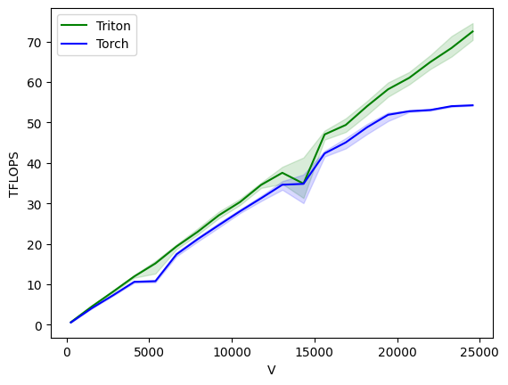

# Spatial Gradient Features Kernel

Spatial Gradient Features is the second layer of the Diffusion Net model architecture, described in
https://arxiv.org/abs/2012.00888.

The operations performed in Spatial Gradients are as followed:

```python
def torch_spatial_gradients(x, grads_real, grads_im, linear_real, linear_im):
    '''
    x: (128, 256)
    grads_real: (NUM_VERTS, 128)
    grads_im: (NUM_VERTS, 128)
    linear_real: (256, 256)
    linear_im: (256, 256)
    '''
    x_grads_real = torch.mm(grads_real, x)
    x_grads_im = torch.mm(grads_im, x)
    x_real = x_grads_real @ linear_real.T - x_grads_im @ linear_im.T
    x_im = x_grads_im @ linear_real.T + x_grads_real @ linear_im.T
    x_dots = x_grads_real*x_real + x_grads_im*x_im
    return torch.tanh(x_dots)
```

128 is the number of eigenvalues that get precomputed, and 256 is the `width` or hidden dimension.
The former is pretty solidly set, but the width can increase or decrease if desired.

## Forward Pass

The forward pass can be written using two kernels.
The first one targets the two matrix multiplications for
`x_grads_real` and `x_grads_im`, then the second one can compute the rest in one kernel.

This performs extremely well, giving the following in benchmarking using BFloat16:


## Backward Pass

The backward pass is a lot more complicated.

`x`, `linear_real` and `linear_im` need gradients accumulated, but have different dimensions.
Gradients flow bad through multiple paths, and hence need to be summed.

This implementation uses 4 separate kernels to compute the backward pass. Two do re-computation and intermediate calculations,
one does the grads for `linear_real/linear_im` and one does the grads for `x`.

This requires fewer saved tensors than the native torch implementation, and performs pretty decently.



### Current slowdown

Two of the backward kernels are slower than just using torch, when `NUM_VERTS` is very large.
This is as they are performing matrix multiplications like `(256, NUM_VERTS)x(NUM_VERTS, 256)`.
A very large inner dimension, with a fairly small outer dimension leads to inefficient use of the GPU.

It's possible that a type of Split-K algorithm may help when `NUM_VERTS` is large, which is next on the list to try.

