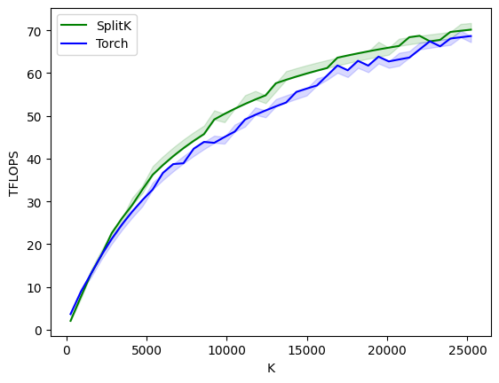

# Split K Kernel

Split-K is an algorithm used in GPU matrix muliplications to gain more parallelism and
can be effective in certain domains.

Consider a matmul of two matrices `A` and `B` with shapes `(256, K), (K, 256)`.
A typical blocked algorithm would dispatch thread blocks to execute output blocks of size `(128, 256)` or `(64, 64)`. When `K >> 256`, this means that each thread block is looping over the full `K` dimension, still with some `BLOCK_K` granularity.
This may not allow for the best GPU utilisation, as a small number of thread blocks are doing many memory and compute operations, which scales in duration as `K` increases.

Instead, each thead block could compute a _partial sum_ along the `K` dimension for their output block, and synchronise reducing their partial sums.
There is an overhead added through the synchronisation, however that is often 'hidden' by the extra parallelism this brings.

This does seem to be beneficial as `K` scales larger. It beats a typical Triton tiled matrix multiplication as is on par with native PyTorch/cuBLAS:

