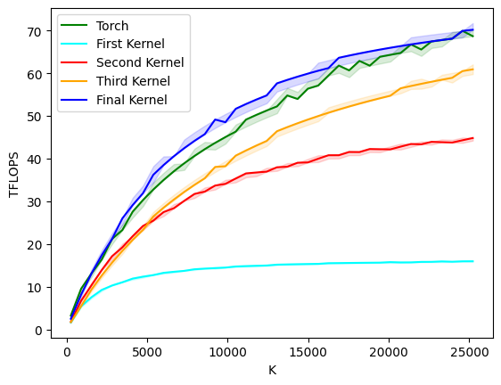

# Split K Kernel

Split-K is an algorithm used in GPU matrix muliplications to gain more parallelism and
can be effective in certain domains.

Consider a matmul of two matrices `A` and `B` with shapes `(256, K), (K, 256)`.
A typical blocked algorithm would dispatch thread blocks to execute output blocks of size `(128, 256)` or `(64, 64)`. When `K >> 256`, this means that each thread block is looping over the full `K` dimension, still with some `BLOCK_K` granularity.
This may not allow for the best GPU utilisation, as a small number of thread blocks are doing many memory and compute operations, which scales in duration as `K` increases.

Instead, each thead block could compute a _partial sum_ along the `K` dimension for their output block, and synchronise reducing their partial sums.
There is an overhead added through the synchronisation, however that is often 'hidden' by the extra parallelism this brings.

This directory shows an iterative process of writting a split-k kernel that is competitive with cuBLAS.
Starting from a naive implementation in `attempt1`, optimizing data access in `attempt2`, optimizing occupancy in `attempt3` and finally
removing extra overhead in `split_k.py`.

This does seem to be beneficial as `K` scales larger. It beats a typical Triton tiled matrix multiplication as is on par with native PyTorch/cuBLAS:

## Worklog

### Attempt 1
The naive approach is _correct_ but very slow, worse than not even doing split-k in the first place. It has a very naive
approach to fetching data - the K dimension is split into chunks and each program iterates through it's own chunk.
This is inefficient as it gives the compiler so chance to coalesce loads, and leads to cache misses and bank conflicts.

### Attempt 2
Fixing the above issues with data loading brings some improvements. Instead of iterating over a chunk, the tiles along the K
dimension are interleaved. So the group of program instances iterate through together, which increases the chances for coalesced loads
and reduces bank conflicts. It's still quite poor, especially as K gets larger.

### Attempt 3
The kernel itself from attempt 2 is decent - but it's not getting great utilisation from the GPU itself.
The benchmarks are using an A100 40GB Nvidia GPU, which has 108 streaming multiprocessors (SMs).
The launch/grid configuration for attempt 2 was naive (purposefully!) as it was based on some config that was found to be
good for a 'normal' blocked Triton matmul. It has a grid size of 128, which gives us one full wave of 108, and a second small wave
of 20. In the second wave, over 80% of the device is sitting idle!

Changing the grid configuration such that this number of 108 or just under is more efficient, and indeed the new configuration
launches 96 program instances (and counter intuitively, uses a SPLIT_K value that isn't a power of 2).

### Attempt 4 / Final
The final changes are two small ones, which really remove some additional overhead.

Firstly, there's a better way to initialise the output tensor to zeros, using a Triton pre-run hook. Since a typical
`torch.zeros` is a `torch.empty` and a `t.fill(0)_` so is noticeably slower than initialising an empty tensor. The pre-run hook
acts on the pointer to the tensor and is more efficient (I have not been able to figure out concretely why that is however).

The second improvement is to use the "relaxed" memory semantic in the atomic addition, since this gives the compiler much
more freedom to perform optimisations. The additions are still fully atomic, but the default "acq-rel" semantic is too strict
for what this kernel needs.